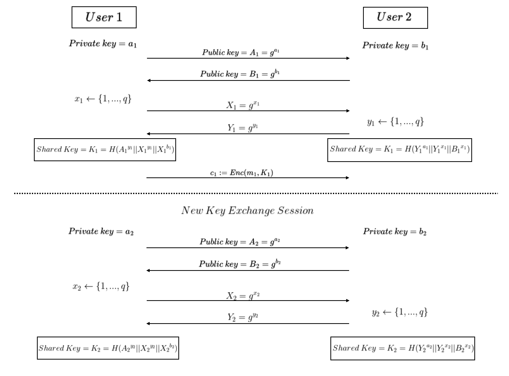
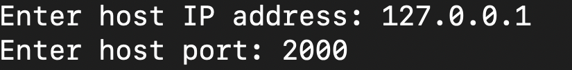

# DenIM - Deniable Instant Messenger

## About
DenIM is a client-to-client instant messaging client offering enhanced deniability and perfect forward secrecy without the involvement of a third-party server.


Built using C++ and powered by Boost and Botan libraries, DenIM is an instance of usable OTR (Off-The-Record) application based on the OTR messaging protocol, accessible to a user even with no security background. 

DenIM offers an encrypted socket-based communication using the standard AES-256 encryption, with a new key derived using Diffie-Hellman(DH) Key Exchange between the parties after each instance of message exchange.



**Key Features**

1. **Deniability for both parties**
> DenIM's underlying communication protocol is deniable with the ability of editing the sent and received messages for both of the parties participating in a session.

2. **Perfect Forward Secrecy**
> With a new 256-bit key generated after each message exchange, DenIM offers perfect forward secrecy which ensures minimal-to-no compromise against the leak of the encryption key.

## Installation

### Docker-based installation

1. Build the Docker image:
```bash
docker build -t denim_project .
```
2. Run the Docker container:
```bash
docker run -it denim_project
```
**NOTE: Make sure you have Docker installed**

### Non-Docker-based  installation

To install and modify using non-docker installation, make sure you have the following dependencies and **make** installed:
- [Boost 1.85.0](https://www.boost.org/users/history/version_1_85_0.html)
- [Botan3](https://botan.randombit.net/)
- [sqlite3](https://www.sqlite.org/cintro.html)

```bash
sudo apt-get install build-essential
```

Open the terminal in the project directory and run:
```bash
make
```

To build using CMake (if CMake is installed):
```bash
cmake --build /. --config Debug --target all -j 12 --
```

## Usage
After building, run the program and enter your IP address and a dedicated port for establishing the communication:




## Contributing

Pull requests are welcome. 

To implement major changes, please open an issue first to discuss about what you would like to change.

